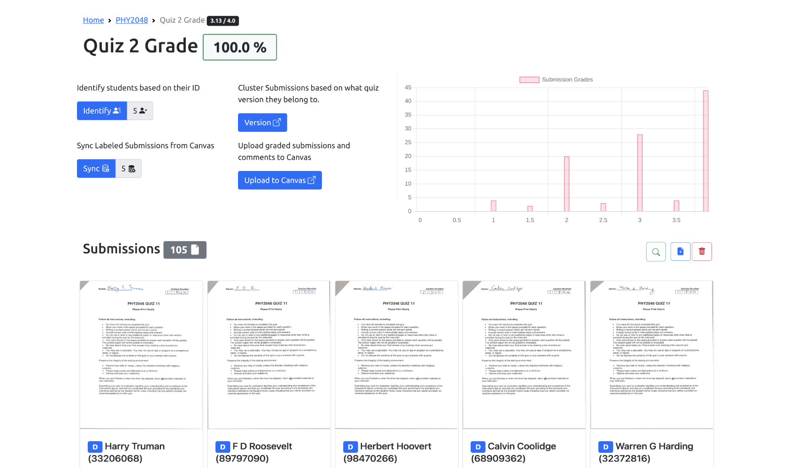

[](https://github.com/IonMich/instructor_pilot/actions/workflows/python-package-conda.yml)

# Instructor Pilot



## Description

A Django app to assist Teaching Assistants and Instructors with Canvas integration.

It depends on the [canvasapi](https://github.com/ucfopen/canvasapi) library.

## Installation

You can find installation instructions [here](https://github.com/IonMich/instructor_pilot/wiki/Installation-Instructions).

# Usage

The installation instructions need to be followed only once. After that, you can run the app by simply navigating to the `instructor_pilot` directory and running:

   ```shell
   conda activate django-ta
   python manage.py runserver
   ```

where you should replace `django-ta` with the name you chose for the conda environment during installation. If you do not recall the name of the conda environment you created, run `conda info --envs` to get a list of all conda environments in your system.

# Updating the source code

You can find update instructions [here](https://github.com/IonMich/instructor_pilot/wiki/Update-instructions).
